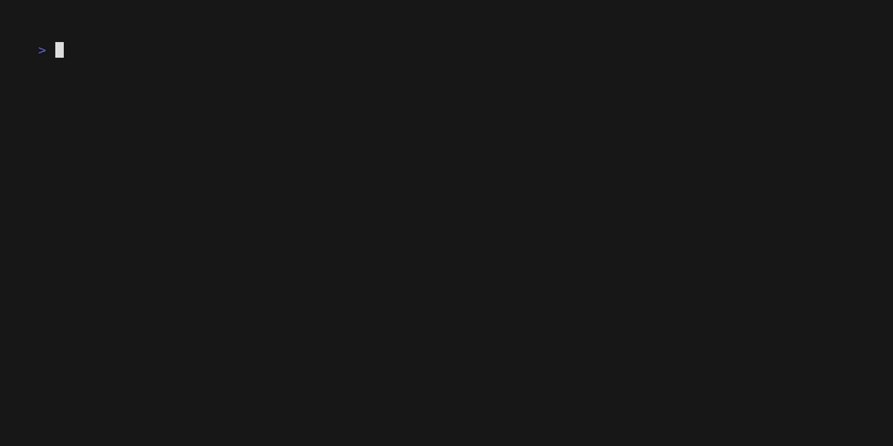

# SSHack
A CTF platform that you access over ssh.
(WIP)

## Demo


## Install

For now, the easiest way to install this is by using the provided install script:
```
  # Install SSHack
  git clone https://github.com/d-z0n/SSHack.git
  cd SSHack
  ./install.sh
```
If this fails, make sure that you have sqlite3-devel installed.
If that doesn't solve it, feel free to submit an issue and if I (or you)
find a solution I will add it here.

## Usage
Add your flags to a toml file,
see the provided `flags.toml` to see how to do this.

Load the files into the flag database by running:
```
  sshack flags load -p <your_flag_file.toml>
```

Then run the server:
```
  sshack run
```

And connect to it from another host using:
```
  ssh -p 1337 <the_server_ip> -o "stricthostkeychecking=no"
```


## Config

At the moment there are only two configurable values,
see `config.toml` to see how to use them.

The theme can be the name of any theme file in the themes folder (without .yaml),
you can also add new themes in `~/.config/sshack/themes` and use them.

